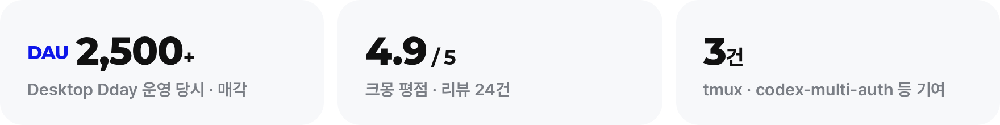
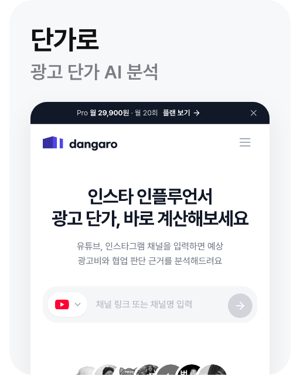
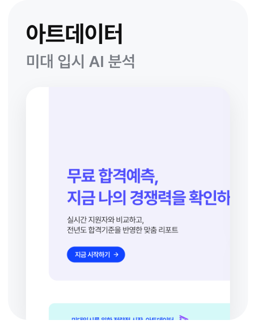
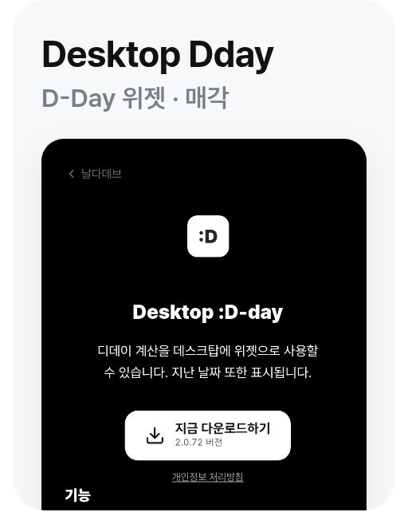
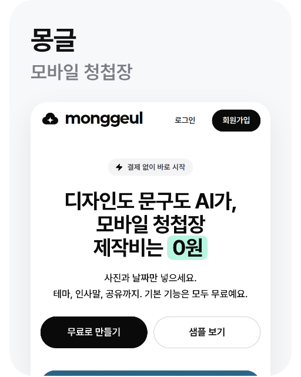
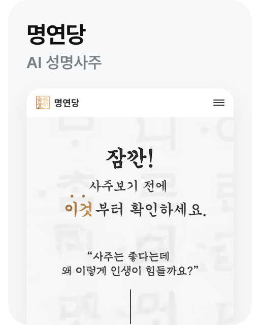

<picture><source media="(prefers-color-scheme: dark)" srcset="assets/banner-dark.png"></picture>

<a href="https://naldadev.com/portfolio/"><picture><source media="(prefers-color-scheme: dark)" srcset="assets/pill-portfolio-dark.png"></picture></a>
<a href="mailto:seongjae@naldadev.com"><picture><source media="(prefers-color-scheme: dark)" srcset="assets/pill-email-dark.png"></picture></a>
<a href="https://kmong.com/@%EB%82%A0%EB%8B%A4%EB%8D%B0%EB%B8%8C"><picture><source media="(prefers-color-scheme: dark)" srcset="assets/pill-kmong-dark.png"></picture></a>

<picture><source media="(prefers-color-scheme: dark)" srcset="assets/nums-dark.png"></picture>

### 대표 작업

<a href="https://naldadev.com/portfolio/dangaro/"><picture><source media="(prefers-color-scheme: dark)" srcset="assets/tile-dangaro-dark.png"></picture></a><a href="https://naldadev.com/portfolio/artdata/"><picture><source media="(prefers-color-scheme: dark)" srcset="assets/tile-artdata-dark.png"></picture></a><a href="https://naldadev.com/portfolio/dday/"><picture><source media="(prefers-color-scheme: dark)" srcset="assets/tile-dday-dark.png"></picture></a><a href="https://naldadev.com/portfolio/monggeul/"><picture><source media="(prefers-color-scheme: dark)" srcset="assets/tile-monggeul-dark.png"></picture></a><a href="https://naldadev.com/portfolio/myeongyeondang/"><picture><source media="(prefers-color-scheme: dark)" srcset="assets/tile-myeongyeondang-dark.png"></picture></a>

**[naldadev.com에서 작업 더 보기 →](https://naldadev.com/portfolio/)**

### 오픈소스

- **[tmux #5409](https://github.com/tmux/tmux/pull/5409)** `upstream 반영` 화면 밖 pane에서 CPU 100% 무한 루프가 되던 문제를 찾아 고쳤어요.
- **[UniClipboard #1436](https://github.com/UniClipboard/UniClipboard/pull/1436)** `Merged` CLI에서 이미지 조회가 실패하던 버그를 고치고 회귀 테스트를 더했어요.

### 기술

**프론트엔드** 
<picture><source media="(prefers-color-scheme: dark)" srcset="https://skillicons.dev/icons?i=vue%2Cnuxtjs%2Creact%2Cnextjs%2Cts%2Ctailwind%2Cvite%2Cpinia&theme=dark"></picture>

**앱·데스크톱** 
<picture><source media="(prefers-color-scheme: dark)" srcset="https://skillicons.dev/icons?i=react%2Celectron%2Ckotlin%2Cswift&theme=dark"></picture> &nbsp;React Native · 네이티브 위젯

**백엔드·DB** 
<picture><source media="(prefers-color-scheme: dark)" srcset="https://skillicons.dev/icons?i=nodejs%2Cexpress%2Cpython%2Cpostgres%2Cmysql%2Credis%2Cprisma&theme=dark"></picture> &nbsp;Hono · Drizzle · Socket.io

**인프라·테스트** 
<picture><source media="(prefers-color-scheme: dark)" srcset="https://skillicons.dev/icons?i=cloudflare%2Cworkers%2Caws%2Cdocker%2Cvitest%2Cjest&theme=dark"></picture> &nbsp;Playwright

<b>수상</b>

- 해양수산부 장관상 (2021)
- 공군 개발사령관상 (2024)
- ST창업오디션 최우수상 (2025) · KORI VOCA
- KOSAC 지역대회(서울) 입상 (2026)
- Disquiet 위클리 프로덕트 · Desktop Dday

 

<a href="mailto:seongjae@naldadev.com"><picture><source media="(prefers-color-scheme: dark)" srcset="assets/outro-dark.png"></picture></a>
